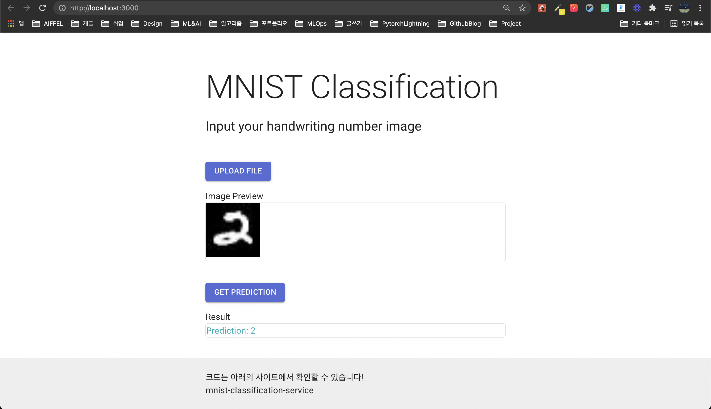

# MNIST Classification Service

😒 without Docker

#### Prerequirements

- npm
- anaconda(or virtualenv)

#### Git clone

```bash
git clone https://github.com/Ssuwani/mnist-classification-service.git
```

#### Anaconda env(Optional)

```bash
conda create -n mnist-cls python=3.7 -y
conda activate mnist-cls
```

## Quick Start

```bash
bash no_docker.sh
```
## Manual

**1. Installation**

```bash
pip install -r train/requirements.txt
pip install -r flask-app/requirements.txt
```

**2. Train Model**

```bash
python train/train.py --epochs 1 --save-model --save-model-path mnist.pt
```

**3. Run Flask App**

run on localhost:5000

```bash
python flask-app/app.py --model_path mnist.pt
```

**4. Run React App(open another terminal)**

run on localhost:3000

```bash
cd web-app/
npm i
npm start
```


**Demo**




😒 without Docker